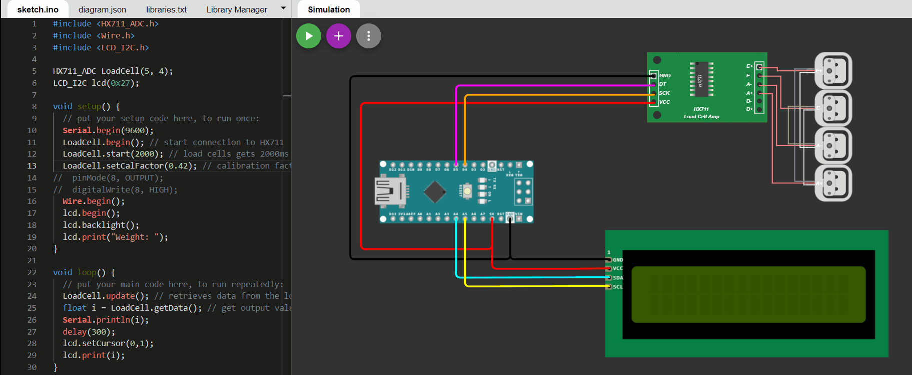
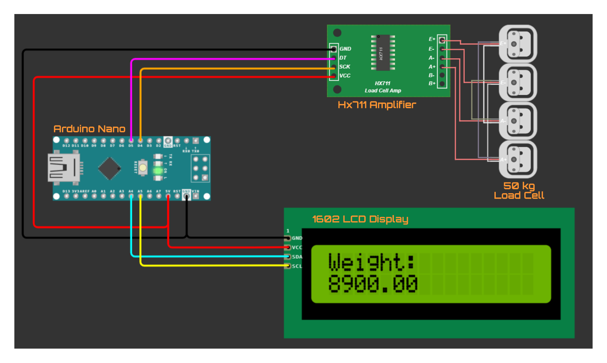
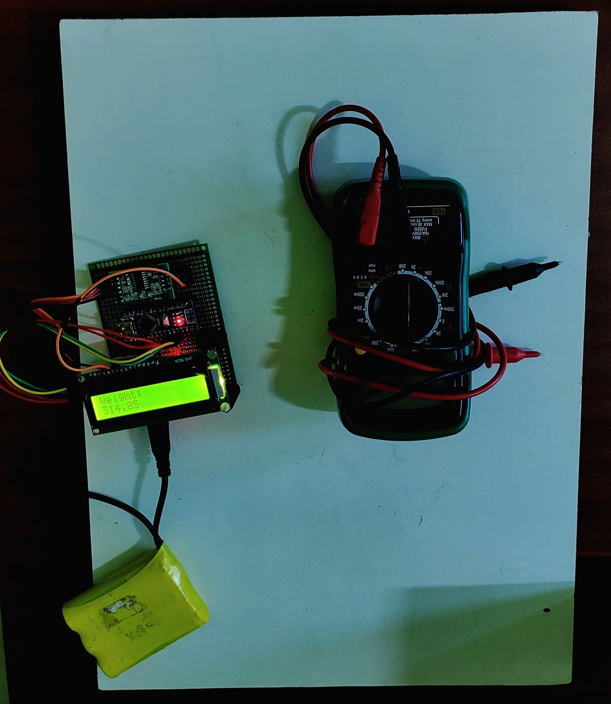

# Weight-Estimation

## 📝 Problem Statement 

At a last mile hub, setup a tool or application that has the ability to measure the dimensions (*length, breadth and height*) and capture volumetric weights by image, depth or any sensory processing as required. The tool will scan an item placed before it one by one, and estimate the volumetric weight provided that same items are expected to have similar volumetric weight. 

Tool will be assisted with a barcode or qr scanner to identify the items (with barcoding or qr code scanning not being the scope of the problem). If similar items do not have the weight or dimensions within a range of accepted error, such items should be **flagged as erroneous**. 

## :skull::weight_lifting: Dead Weight Estimation

 

### :toolbox: Components Used

| Item Name                     | Purpose                                          | Qty |
|-------------------------------|--------------------------------------------------|-----|
| Arduino Nano                  | Central Processing Unit                          | 1   |
| Weighing Load Cell            | Converts force into electric signal (transducer) | 4   |
| Hx711 Weight Pressure Sensor  | Amplification of electrical signals              | 1   |
| Liquid Crystal Display 1602   | Output                                           | 1   |
| 12V Li-Ion Battery            | Input Power Supply                               | 1   |
| 12V to 3.3V Voltage Convertor | Stepping-down voltage                            | 1   |
| Wires and PCB                 | Connection                                       | -   |

### :hammer_and_wrench: Circuit Diagram

### :gear: Physical Setup of Weight Machine

  <i>Top-View of the Weight Machine (315 grams Multimeter being measured)</i>

  <i>Side-View of the Weight Machine (Load cells at bottom of the plate)</i>

## :potable_water: Volumetric Weight Estimation

### :toolbox: Components Used

| Item Name                           | Purpose                   | Qty |
|-------------------------------------|---------------------------|-----|
| Arduino Nano                        | Central Processing Unit   | 1   |
| SHARP Infrared Sensor[GP2Y0A41SK0F] | Distance Measuring Sensor | 1   |
| Liquid Crystal Display 1602         | Output                    | 1   |
| 12V Li-ION Battery                  | Input Power Supply        | 1   |
| 12 V to 3.3 V Voltage Converter     | Stepping-down Voltage     | 1   |
| Wires and PCB                       | Connection                | 1   |

### Running the container:
1. `cd '.\Volumetric Weight Estimation\'`
2. `docker build -t weight_estimation .`
3. `docker run -d -p 5000:5000 weight_estimation2`

### API Documentation:
**1. Get Volume and other details:**

* **URL**: http://localhost:5000/volume

* **Method:** `POST`
  
*  **URL Params**

   **Required:**
   
   form-data
    | key | data |
    |:---:|:----:|
    | file| image.jpeg |
    
    (Upload your file here)

* **Success Response:**
  
  * **Code:** 201  
    **Content:** `{
    "area": 83.42484632380285,
    "breadth": 3.68,
    "length": 4.44
}`

* **Error Response:**

  * **Code:** 406  
    **Content:** `{
    "message": "Poor Lightning Conditions, Fix and Try Again"
}`
